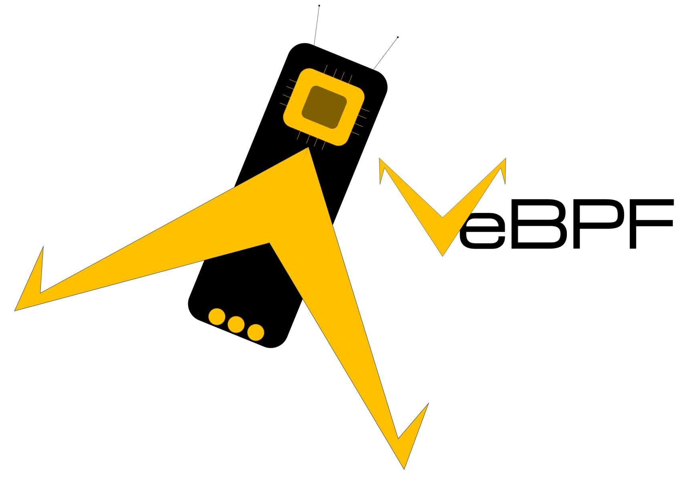
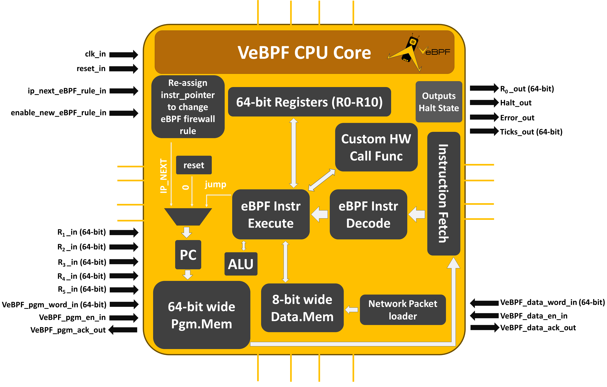
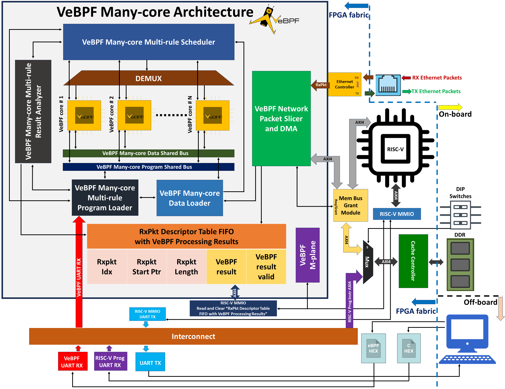
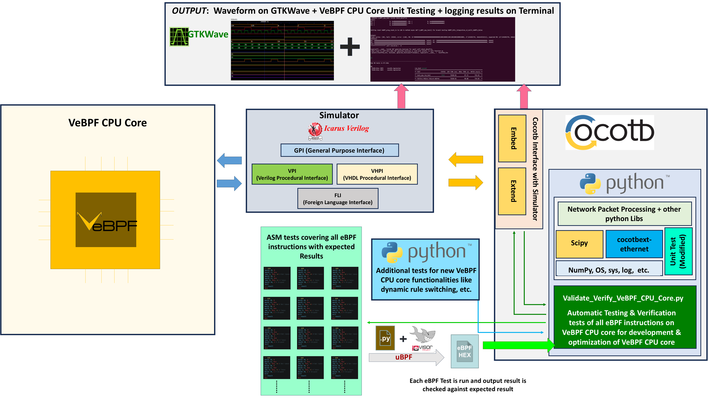
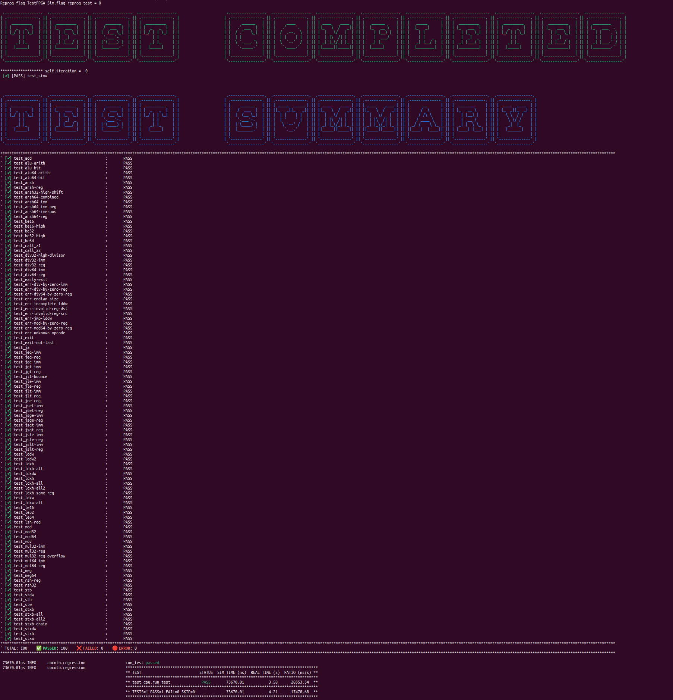
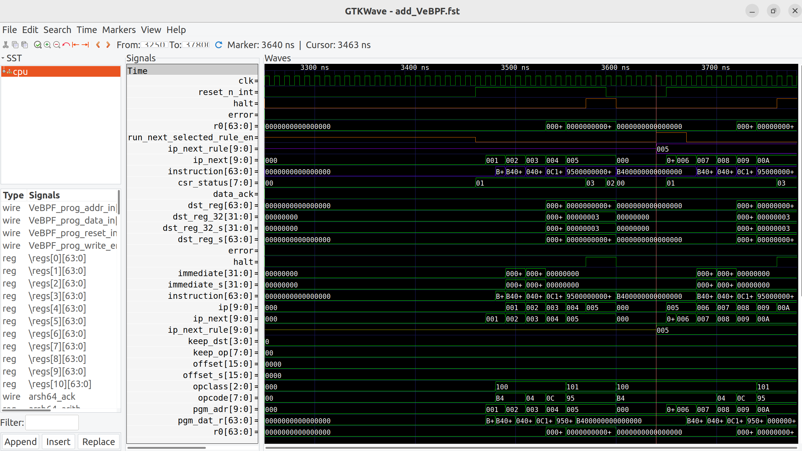

<div style="display: flex; align-items: center;">
  
  <h1 style="margin: 0; font-size: 3em;">VeBPF: Verilog eBPF CPU Core</h1>
</div>

[](https://github.com/zaidtahirbutt/VeBPF/actions)
[](LICENSE)

**VeBPF** is a resource-optimized, eBPF (extended Berkeley Packet Filter) ISA-compliant CPU core implemented in Verilog HDL for FPGA-based network packet processing in SmartNICs and IoT devices.

<p align="center">
  
</p>
<p align="center"><em>VeBPF CPU Core Architecture Overview</em></p>

## Overview

This repository contains the **VeBPF CPU core** Verilog HDL source code that has been tested on hardware by implementing/synthesizing on Artix-7 Arty100T and Artix-7 AX7200 FPGA boards, as well being fully integrated with a simulation test suite activated in CI/CD; so that any upgrades developers make on this VeBPF core, the core is still fully eBPF ISA compliant.

VeBPF specializes in network packet processing and is fully compliant with the eBPF instruction set architecture. The core is implemented in Verilog HDL for easy integration with existing FPGA IP blocks and subsystems.

**Key Features:**
- eBPF ISA compliant (supports all native eBPF instructions)
- Harvard architecture with separate program and data memory
- 11 × 64-bit registers (R0-R10)
- Resource-optimized design
- Single clock cycle eBPF rule switching capability
- Configurable data and program memory depths
- Custom call handler for application-specific hardware accelerators

## Real-World Applications

The VeBPF CPU core serves as the Processing Element (PE) in the **VeBPF Many-Core Architecture** designed for high-performance network packet processing in FPGA-based systems. This architecture enables real-world deployment in:

### SmartNICs and Network Processing
- **Line-rate packet processing** for 100+ Gbps network interfaces
- **Parallel eBPF rule execution** across multiple VeBPF cores
- **Dynamic rule updates** without FPGA reconfiguration (single clock cycle switching)
- **Offload network functions** from host CPUs to FPGA accelerators

### IoT and Edge Security
- **FPGA-based IoT firewalls** with real-time threat detection
- **Resource-optimized design** suitable for low-end FPGAs
- **Cybersecurity applications**: packet filtering, intrusion detection, DDoS mitigation
- **Edge computing** with network packet processing at the device level

<p align="center">
  
</p>
<p align="center"><em>VeBPF Many-Core Architecture for Network Functions (from IEEE HPEC 2024 paper)</em></p>

The many-core architecture instantiates multiple VeBPF CPU cores (configurable via `NVeBPF` parameter) that execute different eBPF rules in parallel on the same network packet, achieving minimal latency. The architecture has been validated with firewall applications processing network packets at line-rate on Arty A7-100T FPGA boards, demonstrating practical deployment for both high-end SmartNICs and resource-constrained IoT devices.

**For the complete VeBPF Many-Core Architecture implementation** (synthesis and simulation framework), see: **[VeBPF Many-Core Repository](https://github.com/zaidtahirbutt/VebpfManyCore)**

## Publication

This work has been published at IEEE HPEC 2024 [here](https://ieeexplore.ieee.org/abstract/document/10938505) and also available in arxiv [here](https://arxiv.org/abs/2512.12778):

> **Z. Tahir, A. Sanaullah, S. Bandara, U. Drepper and M. Herbordt**, "VeBPF Many-Core Architecture for Network Functions in FPGA-based SmartNICs and IoT," *2024 IEEE High Performance Extreme Computing Conference (HPEC)*, Wakefield, MA, USA, 2024, pp. 1-9, doi: 10.1109/HPEC62836.2024.10938505.

**Keywords:** Codes, Software libraries, Computer architecture, Hardware, Internet of Things, Hardware design languages, Computer security, Field programmable gate arrays, Optimization, Python, FPGA, Many-core, Multi-core, eBPF, Smart-NIC, IoT, RISC-V, Network Communication, Cybersecurity

## Quick Start

### Prerequisites

- **Icarus Verilog**: HDL simulator
- **GTKWave**: Waveform viewer for analyzing simulation results
- **Miniconda/Anaconda**: Python environment manager
- **Python 3.7+**: Required for Cocotb testbench

### Installation

1. **Install Icarus Verilog and GTKWave**
   ```bash
   sudo apt-get update
   sudo apt-get install -y iverilog gtkwave
   ```

2. **Set up Python environment**
   ```bash
   conda env create -f VeBPF_tb/vebpf_env.yml
   conda activate vebpf_env
   ```

3. **Verify installation**
   ```bash
   which iverilog
   iverilog -V
   python --version
   python -c "import cocotb; print('cocotb version:', cocotb.__version__)"
   ```

### Running Simulation

<p align="center">
  
</p>
<p align="center"><em>Automatic Testing Framework for VeBPF CPU Core Development</em></p>

#### Full eBPF ISA Test Suite

To run the complete VeBPF CPU instruction test suite:

```bash
cd VeBPF_tb
make
```

This executes **all eBPF ISA instruction tests** on the VeBPF CPU core using the Cocotb-based automatic testing framework. The test suite validates complete eBPF ISA compliance - if any single eBPF instruction fails, the entire test suite fails. This ensures developers can confidently develop new features while maintaining ISA compliance.

<p align="center">
  
</p>
<p align="center"><em>Terminal output showing all eBPF ISA tests passing successfully</em></p>

After running `make`, view the complete test waveform:

```bash
cd VeBPF_tb/eBPF_tests/eBPF_all_instructions
gtkwave add_VeBPF.fst
```

#### Running Individual Instruction Tests

You can also run individual eBPF instruction tests for focused debugging. All available test targets are listed in the Makefile. For example, to test only the ADD instruction:

```bash
cd VeBPF_tb
make ebpf_inst_1_add
```

Then view the waveform for this specific test:

```bash
cd VeBPF_tb/eBPF_tests/ebpf_inst_1_add
gtkwave add_VeBPF.fst
```

**Testing the Single Clock Cycle Reprogramming Feature:**

To test the VeBPF CPU core's unique single clock cycle eBPF rule switching capability, use the `REPROG=1` flag:

```bash
cd VeBPF_tb
make ebpf_inst_1_add REPROG=1
```

This demonstrates the reprogramming feature where the VeBPF core can switch between different eBPF rules in just a single clock cycle by changing the instruction pointer externally, without needing to reload the entire program memory.

All individual eBPF ISA tests can be run separately (see `VeBPF_tb/Makefile` for complete list), and their corresponding waveforms are available in their respective folders under `VeBPF_tb/eBPF_tests/`.

### Viewing Simulation Waveforms

GTKWave opens with the waveform data, allowing you to:
- Inspect signal transitions and timing
- Debug CPU state machine behavior
- Verify instruction decode and execution
- Analyze register file operations
- Trace memory access patterns

<p align="center">
  
</p>
<p align="center"><em>GTKWave Waveform Output from <code>make ebpf_inst_1_add REPROG=1</code></em></p>

The waveform above shows the output from running `make ebpf_inst_1_add REPROG=1`. Notice that the **Halt signal goes HIGH twice** in the simulation - this demonstrates the reprogramming feature in action. The VeBPF core executes the first eBPF program (Halt goes HIGH at completion), then the instruction pointer is changed in a single clock cycle to execute a second eBPF rule (Halt goes HIGH again at completion). This validates the single clock cycle eBPF rule switching capability described in the paper.

Use the hierarchy browser on the left to add signals to the waveform viewer for detailed analysis.

## Continuous Integration (CI/CD)

This repository includes a **full CI/CD pipeline** configured via `.github/workflows/ci.yml` that automatically validates all code changes pushed to the repository.

### Automated Testing on Every Push

The CI pipeline automatically:
- ✅ Sets up the complete test environment (Icarus Verilog, Miniconda, Cocotb)
- ✅ Runs the **entire eBPF ISA test suite** on every commit
- ✅ Validates eBPF ISA compliance across all instructions
- ✅ **Fails the build** if any bugs are introduced or if changes break ISA compliance

This ensures that:
- Developers can push code with confidence
- Any regression or ISA non-compliance is caught immediately
- The VeBPF CPU core remains verified and ISA-compliant at all times
- Code quality is maintained across all contributions

You can view the CI status and test results in the [Actions tab](https://github.com/zaidtahirbutt/VeBPF/actions) of the repository, or check the CI badge at the top of this README.

## Repository Structure

```
VeBPF/
├── cpu.v                   # VeBPF CPU core (main)
├── ram64_memory_v3.v       # 64-bit program memory
├── ram_module_v3.v         # Data memory
├── call_handler.v          # Custom eBPF call instruction handler
├── divider.v               # Division unit
├── shifter.v               # Shift operation unit
├── iverilog_dump_sv.sv     # SystemVerilog waveform dumper
├── VeBPF_tb/               # Testbench and simulation framework
│   ├── Makefile            # Main simulation runner
│   ├── test_cpu.py         # Cocotb testbench (Python)
│   ├── vebpf_env.yml       # Conda environment specification
│   └── eBPF_tests/         # 100+ eBPF instruction tests
├── tools/                  # Supporting tools (ubpf, wishbone-utils)
├── firmware/               # eBPF programs (VeBPF Firewall), uploading, compilation scripts for synthesis and simulation
└── .github/workflows/      # CI/CD automation
```

## Architecture

The VeBPF CPU core features:

- **Harvard Architecture**: Separate 64-bit program memory and 8-bit data memory
- **Register File**: 11 × 64-bit registers (R0-R10)
  - R1-R5: Input registers (preserved on reset)
  - R0: Output register
- **ALU**: Supports all eBPF arithmetic and logic operations
- **Branch Unit**: Conditional and unconditional jumps
- **Memory Interface**: Load/store with configurable data memory depth
- **Call Handler**: Programmable custom hardware accelerator interface

### Key Optimizations

1. **Single-cycle rule switching**: Reprogram the CPU to different eBPF rules by changing the instruction pointer externally
2. **Minimal resource footprint**: Resource optimized computer architecture
3. **Native eBPF support**: No custom compiler required - uses standard eBPF toolchains

## Testing Framework

VeBPF includes a comprehensive automatic testing framework built with:
- **Cocotb**: Coroutine-based co-simulation library
- **Python**: Test orchestration and packet generation
- **Icarus Verilog**: RTL simulation backend

The framework validates all eBPF instructions across 100+ test cases covering:
- ALU operations (arithmetic, logic, shifts)
- Memory access (load/store, byte/half-word/word/double-word)
- Branch instructions (conditional/unconditional jumps)
- Call instructions (helper hardware acceleration function interface)

## Contributing

Contributions are welcome! Please:
1. Fork the repository
2. Create a feature branch (`git checkout -b feature/YourFeature`)
3. Commit your changes (`git commit -m 'Add YourFeature'`)
4. Push to the branch (`git push origin feature/YourFeature`)
5. Open a Pull Request

## License

This project is licensed under the MIT License - see the [LICENSE](LICENSE) file for details.

## Contact

**Zaid Tahir** - zaidt@bu.edu - zaid.butt.tahir@gmail.com | [Zaid Tahir LinkedIn](https://www.linkedin.com/in/zaidtb/)

CAAD Lab, Boston University
[http://www.bu.edu/caadlab/](http://www.bu.edu/caadlab/)

## Citation

If you use VeBPF in your research, please cite:

```bibtex
@INPROCEEDINGS{10938505,
  author={Tahir, Zaid and Sanaullah, Ahmed and Bandara, Sahan and Drepper, Ulrich and Herbordt, Martin},
  booktitle={2024 IEEE High Performance Extreme Computing Conference (HPEC)}, 
  title={VeBPF Many-Core Architecture for Network Functions in FPGA-based SmartNICs and IoT}, 
  year={2024},
  volume={},
  number={},
  pages={1-9},
  keywords={Codes;Software libraries;Computer architecture;Hardware;Internet of Things;Hardware design languages;Computer security;Field programmable gate arrays;Optimization;Python;FPGA;Many-core;Multi-core;eBPF;Smart-NIC;IoT;RISC-V;Network Communication;Cybersecurity},
  doi={10.1109/HPEC62836.2024.10938505}
}
```

## Related Work

For additional context on FPGA-based communication primitives and hardware operating systems, see:

**Zaid Tahir**. ["Flexible communication primitives for diverse deployment scenarios of hardware operating systems for FPGAs"](https://open.bu.edu/items/59de06b0-e45d-44c1-a9ec-3d30270f442f). PhD Thesis, Boston University, 2024.